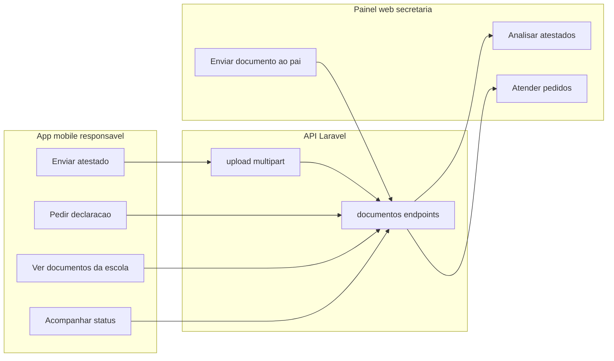

# Módulo Documentos (pai ↔ secretaria via web)

## Decisão de escopo (confirmada)

- **Mobile (este repo):** só o **responsável** — envia atestado, pede declaração, vê status e documentos que a escola enviou.
- **Secretaria:** analisa, aprova/recusa e envia documentos no **painel web** (fora deste app).
- **Professor:** sem telas de Documentos nesta v1.

## Por que módulo próprio (não recado)

Recados misturam conversa livre. Atestado e declaração precisam de **status**, datas de falta, tipo de pedido e histórico auditável. Reaproveitamos só a infraestrutura de anexo (`AttachmentCard`, `postFormData`, `StudentContext`).

## Modelo de domínio (contrato API)

Um recurso unificado `Documento` (ou `SolicitacaoDocumento`) com `tipo`:

| tipo | origem | o que o pai faz no app |
|------|--------|------------------------|
| `atestado` | pai | cria com PDF/foto + período da falta + observação |
| `pedido_declaracao` | pai | cria pedindo tipo de declaração (ex.: matrícula, frequência) + observação |
| `documento_escola` | secretaria (web) | só lê/baixa no app |

**Status sugeridos:**

- Atestado / pedido: `enviado` → `em_analise` → `aprovado` | `recusado` | `atendido` (pedido com anexo de resposta)
- Documento da escola: `disponivel` (já entregue ao pai)

Campos principais:

- `id`, `aluno_id`, `tipo`, `status`, `titulo`, `descricao`
- Atestado: `data_inicio`, `data_fim` (faltas)
- Pedido: `categoria_declaracao` (enum string acordado com o backend)
- `anexo_url` (envio do pai ou arquivo da escola)
- `anexo_resposta_url` (opcional, quando a secretaria devolve o PDF)
- `motivo_recusa`, `criado_em`, `atualizado_em`

**Endpoints mobile sugeridos** (Laravel `/api/mobile/...`):

- `GET /documentos?aluno_id=` — lista do aluno selecionado
- `GET /documentos/:id`
- `POST /documentos` — JSON para pedido sem arquivo, ou multipart quando houver anexo
- `POST /documentos/:id/anexo` — upload do arquivo (padrão espelhando `authService.updatePhoto` / `postFormData`)
- Push: novo tipo `documento` (pai notificado quando status muda ou escola envia arquivo)

> Este repositório é só o app. A API e o painel web precisam ser implementados em paralelo; o app pode começar com service + telas contra o contrato acima (mock/homolog quando a API existir).

## O que implementar no app

### 1. Dependência e upload

- Adicionar `expo-document-picker` (PDF + imagens; web + native).
- Serviço `services/documentos.ts`: tipos + `list`, `get`, `createAtestado`, `createPedido`, upload via `apiClient.postFormData`.
- Reusar `utils/attachment.ts` / `AttachmentCard` na detalhe.

### 2. Telas (só `responsavel`)

| Rota | Função |
|------|--------|
| `app/documentos.tsx` | Lista com abas/filtros: Atestados · Pedidos · Da escola; FAB “Novo” |
| `app/documento-detail.tsx` | Status, datas, anexo, motivo de recusa, anexo de resposta |
| `app/enviar-atestado.tsx` | Aluno (já selecionado), período, observação, anexar arquivo, enviar |
| `app/pedir-declaracao.tsx` | Tipo de declaração, observação, enviar (anexo opcional) |

Registrar rotas protegidas em `app/_layout.tsx`.

### 3. Navegação

- Entrada no home do responsável (`app/(tabs)/index.tsx`), no mesmo espírito do atalho de Boletim — **sem** item novo no BottomNav nesta v1 (evita saturar a barra).
- Lista filtrada pelo `selectedStudent` do `StudentContext`.
- Professor: nenhuma entrada; se abrir rota, redirecionar.

### 4. UX mínima

- Estados vazios claros (“Nenhum atestado enviado”).
- Chip de status com cores já usadas no app (`Colors`).
- Após enviar: modal de sucesso (reusar `SuccessModal` se existir) e voltar à lista.
- Abrir PDF/imagem com o fluxo atual de `openAttachment`.

### 5. Docs de integração

- Atualizar `API_SETUP.md` com o contrato dos endpoints de documentos para o time do backend/web.

## Fora deste app (necessário para o pacote “funcionar de ponta a ponta”)

- Painel web da secretaria: inbox de atestados/pedidos, mudar status, upload de resposta, “enviar documento ao pai”.
- Regras de quem é “secretaria” no backend (papel que o mobile não precisa conhecer nesta v1).

## Ordem de entrega sugerida

1. Contrato API documentado + `services/documentos.ts`
2. Lista + detalhe (leitura) — já permite ver o que a escola enviar
3. Fluxo enviar atestado (picker + upload)
4. Fluxo pedir declaração
5. Atalho no home + push `documento` quando a API/notificações suportarem

## Riscos / cuidados

- Sem API, as telas não fecham o ciclo; alinhar cedo com o backend.
- Limite de tamanho/tipo de arquivo (PDF/JPG/PNG) deve vir da API e ser validado no client.
- LGPD: atestado é dado sensível — só o responsável do aluno e a secretaria devem ver (garantia no backend).
